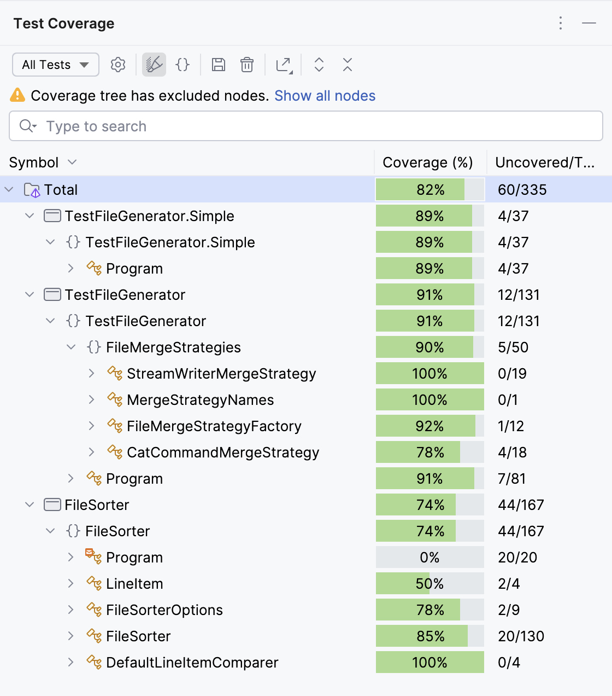

# Text File Processor

This solution contains .NET console apps for processing large text files with a specific format.

## Project Structure

- `TestFileGenerator`: Generates test files in the format `<Number>. <String>` with parallel execution
- `TestFileGenerator.Simple`: Generates test files in the format `<Number>. <String>` without parallelization
- `FileSorter`: Sorts large text files according to specified criteria
- `*.Tests`: Test suites

## Building the Solution

The solution is built with .NET 9. The development machine is MacBook Pro M1 16Gb.

```bash
dotnet build
```

## Test File Generator

The Test File Generator creates text files with the specified format.

### Usage

```bash
dotnet run --project TestFileGenerator.Simple/TestFileGenerator.Simple.csproj <output_file_path> <file_size_in_mb>
# OR
dotnet run --project TestFileGenerator/TestFileGenerator.csproj <output_file_path> <file_size_in_mb> [merge_strategy]
```
- `merge_strategy` can be `cat` (default) or `streamwriter`.

#### Examples:

```bash
dotnet run --project TestFileGenerator/TestFileGenerator.csproj test.txt 100 
```
This will generate a 100MB test file named `test.txt` in the multi-thread mode merging chunks of the resulted
file with OS's `cat` command (the fastest option, ~300-500 MB/s).

```bash
dotnet run --project TestFileGenerator/TestFileGenerator.csproj test.txt 100 streamwriter
```
This will generate a 100MB test file named `test.txt` in the multi-thread mode using `StreamWriter`
(the intermediate option, ~250-270 MB/s).

```bash
dotnet run --project TestFileGenerator.Simple/TestFileGenerator.Simple.csproj test.txt 100
```
This will generate a 100MB test file named `test.txt` in the single thread mode using `StreamWriter`
(the slowest option, ~200 MB/s).


#### My tests (the fastest option):

```
100 MB -- less than 1 second
500 MB -- 1.5 seconds
1 GB -- 3 seconds
5 GB -- 10 seconds
10 GB -- 22 seconds
100 GB -- TBD
```

## File Sorter

The File Sorter processes large files using an external sorting algorithm.
It sorts the lines first by the string part (alphabetically) and then by the number
(ascending) when strings are identical.

### Usage

```bash
dotnet run --project FileSorter/FileSorter.csproj <input_file_path> <output_file_path>
```

Example:
```bash
dotnet run --project FileSorter/FileSorter.csproj test.txt sorted.txt
```

#### My tests:

```
100 MB -- 7 seconds
500 MB -- 30 seconds
1 GB -- 1 min
5 GB -- 11 min
10 GB -- 30 min
100 GB -- TBD
```

## Implementation Details

### Test File Generator
I tried three options there:
- the simplest but the slowest one: one thread + `StreamWriter` (implemented in `TestFileGenerator.Simple` project)
- two more complex options: generate several (number of CPU cores) chunks in parallel, then using `StreamWriter`
**or** Unix's `cat` command for merging chunks into a result file (implemented in `TestFileGenerator` project)

I found that the fastest option is to create chunks + `cat` command. Though it's 2x times faster, it's not a drastic
improvement, so I'd prefer the simplest option as its code is clearer and shorter.

### File Sorter
- Uses external sorting to handle large files
- Splits input into manageable chunks
- Sorts chunks in memory
- Merges sorted chunks while maintaining sort order

### Other possible options
Another (crazy?) option that I considered is to use a database for the purpose.
This is how it could look:
- create a table with two columns (`int` and `varchar`)
- import data 
- build indexes
- export data of a sorted query using the database's tools (like `COPY` command in PostgreSQL)

I didn't play around with it, though, just one of ideas.

## Limitations and other thoughts
- didn't try more than 10 GB files for the test file generation as well as for sorting 
- a couple of tests are flaky. When the whole test suite runs, they fail, but pass if I run the failed ones one by one.
I haven't looked at the cause
- for data in the test file generator we could use `Bogus` as a source of fake data
- no check for a free storage

## Test coverage

